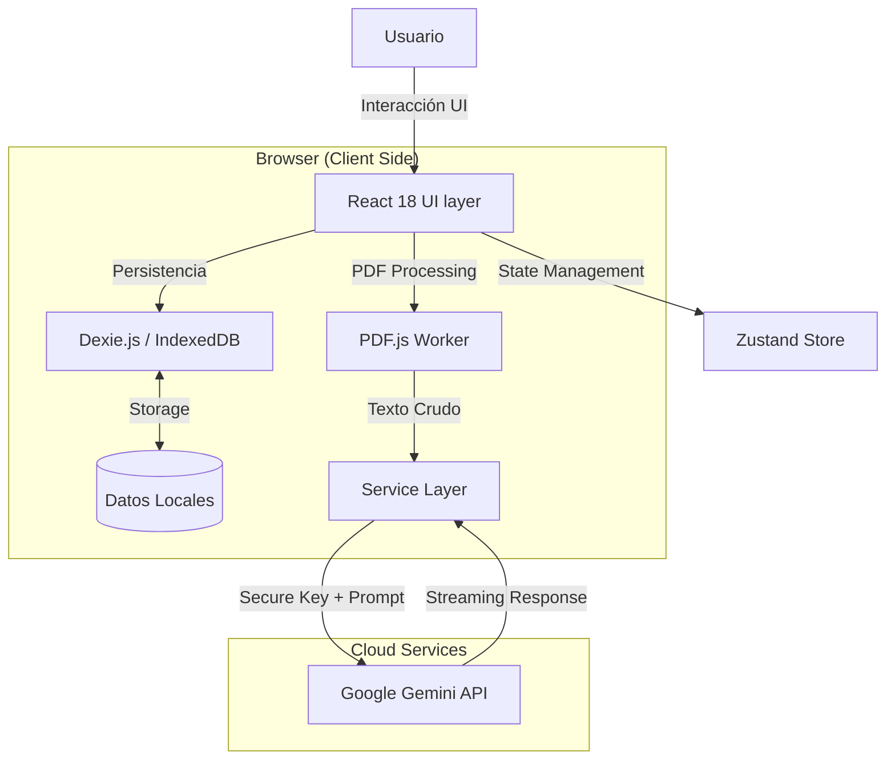

# INFORME TÉCNICO: AULA VIVA AI (Versión PWA)

**Autor:** Christopher Schiefelbein  
**Fecha:** Diciembre 2025  
**Versión del Sistema:** 2.0 (Stable Web Port)  
**Contexto:** Proyecto de Portafolio / Ingeniería Informática

---

## 1. Resumen Ejecutivo

Aula Viva AI v2.0 es una refactorización web completa de la aplicación móvil nativa original. El objetivo técnico fue migrar la lógica de negocio y la experiencia de usuario desde un entorno **Android (Kotlin/XML)** a una **Progressive Web App (React/TypeScript)**, manteniendo la robustez pero eliminando la barrera de entrada de la instalación de APKs.

Esta versión demuestra la capacidad de implementar arquitecturas modernas de **"Client-Side AI"**, donde el procesamiento inteligente de documentos ocurre descentralizadamente, utilizando el navegador del usuario como entorno de ejecución principal.

---

## 2. Arquitectura del Sistema

### 2.1 Modelo: "Thick Client / Local-First"
A diferencia de las aplicaciones web tradicionales que dependen de un servidor API REST para cada operación de datos, Aula Viva adopta un enfoque **Local-First**:

*   **Persistencia**: Se utiliza `IndexedDB` (vía Dexie.js) como base de datos transaccional completa en el navegador.
*   **Ventaja Técnica**: Latencia cero en navegación, funcionamiento offline real y privacidad de datos inherente.
*   **Justificación**: Para una demo de portafolio, esto elimina costos de servidor (AWS/GCP) y garantiza que el evaluador pueda probar el sistema completo al instante, sin configurar backends.

### 2.2 Diagrama de Flujo de Datos

---

## 3. Stack Tecnológico Detallado

### 3.1 Frontend (Core)
*   **React 18**: Utilizado por su ecosistema maduro y modelo de componentes.
*   **Vite**: Seleccionado sobre Create-React-App por su velocidad de compilación (ESBuild) y manejo nativo de ESM, crucial para workers de PDF.
*   **TypeScript**: Tipado estático estricto para garantizar mantenibilidad y reducir errores en tiempo de ejecución (especialmente en el manejo de estructuras de datos complejas de la IA).

### 3.2 UI/UX System
*   **Tailwind CSS**: Para estilizado atómico y rápido. Se implementó un tema personalizado "Cyberpunk" usando variables CSS para colores neón (`#00FF41`, `#7C3AED`) sobre fondos oscuros (`#0F0E16`).
*   **Framer Motion**: Orquestación de animaciones complejas (transiciones de página, entrada de tarjetas, micro-interacciones) para emular la fluidez de una app nativa.
*   **Glassmorphism**: Uso intensivo de `backdrop-filter: blur()` para capas de profundidad visual.

### 3.3 Inteligencia Artificial (RAG)
La característica estrella es la implementación de **RAG (Retrieval-Augmented Generation)** puramente en el cliente:

1.  **Ingesta**: El usuario sube un PDF.
2.  **Extracción**: `PDF.js` se ejecuta en un Web Worker para extraer texto plano sin bloquear el hilo principal.
3.  **Prompt Engineering**: Se inyecta el texto extraído dentro de un "System Prompt" diseñado específicamente según el rol (Docente vs Alumno).
    *   *Prompt Docente*: Enfocado en didáctica, bloom's taxonomy y planificación.
    *   *Prompt Alumno*: Enfocado en simplificación, analogías y mnemotecnia.
4.  **Inferencia**: Se envía a **Gemini 3 Flash (Preview)**, seleccionado por su capacidad de razonamiento superior. El sistema implementa una estrategia de *Fallback* automática a **Gemini 2.5 Flash** en caso de saturación, garantizando disponibilidad.

---

## 4. Decisiones de Diseño & Trade-offs

| Decisión | Alternativa | Razón de la Elección |
| :--- | :--- | :--- |
| **IndexedDB (Local)** | PostgreSQL (Server) | Portabilidad total para demos. Elimina dependencia de backend hosting activo. |
| **API Key Local** | Proxy Server | Privacidad y simplicidad. El usuario trae su propia llave ("BYOK"), evitando costos para el desarrollador. |
| **Gemini Flash** | GPT-4o | Costo/Beneficio. Flash es gratuito en tier básico y mucho más rápido para volúmenes grandes de texto. |
| **PWA** | React Native | "Write once, run everywhere". Acceso vía URL sin fricción de instalación. |

---

## 5. Seguridad

Aunque es una demo, se aplicaron principios de seguridad:
1.  **Enclave de API Key**: La llave nunca se expone en código ni repositorios. Se guarda en `localStorage` del usuario.
2.  **Sanitización**: `react-markdown` y `rehype-raw` están configurados para prevenir inyecciones XSS en las respuestas de la IA.
3.  **Roles Estrictos**: La UI se adapta dinámicamente según el rol (`user.role`), ocultando controles de edición a alumnos.

---

## 6. Conclusión y Proyección

Aula Viva PWA v2.0 cumple con éxito el objetivo de trasladar la experiencia compleja de la app nativa a la web moderna. Demuestra dominio sobre el ciclo completo de desarrollo: desde la base de datos (con Dexie), pasando por la lógica de negocio y estado (Zustand), hasta una interfaz pulida y de alto rendimiento.

**Próximos Pasos (Roadmap Teórico):**
1.  Sincronización Cloud opcional (Supabase) para multi-dispositivo.
2.  Modo Colaborativo: Websockets para clases en vivo.
3.  Voz a Texto: Interacción de voz con el tutor IA.

---
*Fin del Informe Técnico.*
